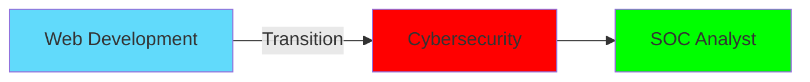

<div align="center">
  
</div>

<h1 align="center">
   
  Hi, I'm Damodar Patil!
</h1>

<div align="center">
  <a href="https://www.linkedin.com/in/damodarpatil">
    
  </a>
  <a href="https://twitter.com/damodar_83">
    
  </a>
  <a href="mailto:patildamodar1983@gmail.com">
    
  </a>
</div>

<div align="center">
  
</div>

---

## 🎯 Current Mission

```javascript
const damodar = {
  currentFocus: "Cybersecurity & SOC Analysis",
  status: "Transitioning from Web Development",
  goal: "Becoming a SOC Analyst",
  passion: ["Digital Security", "Continuous Learning", "Problem Solving"]
};
```

## 🛡️ Cybersecurity Journey
<p align="center">
  
  
  
  
  
</p>

### 🎓 Currently Learning
```python
current_focus = {
    "networking": ["TCP/IP", "OSI Model", "Network Protocols"],
    "security_tools": ["Wireshark", "Nmap", "tcpdump"],
    "operating_systems": ["Linux", "Windows Server"],
    "certifications": ["Network+", "Security+"],
    "skills": ["Log Analysis", "Incident Response", "Threat Detection"]
}
```

## 💻 Development Background

### Frontend Development
<p align="center">
  
  
  
  
  
  
</p>

### Backend Development
<p align="center">
  
  
  
  
</p>

## 📊 GitHub Analytics
<div align="center">
  
</div>
<div align="center">
  
  
</div>

## 🔄 My Journey


## 🎯 Next Targets
- 🔒 Mastering network security fundamentals
- 📝 Achieving Network+ certification
- 🛡️ Building a home security lab
- 🎯 Landing a SOC Analyst role

## 💭 Philosophical Corner
> "In the world of cybersecurity, yesterday's solutions are today's vulnerabilities. The key is continuous learning."

## 🤝 Let's Connect!
I'm always excited to connect with:
- 🔒 Cybersecurity professionals
- 💻 Fellow developers
- 🌱 Career transitioners
- 📚 Continuous learners

Feel free to reach out for discussions about security, development, or career transitions!

---

<div align="center">
  
</div>
